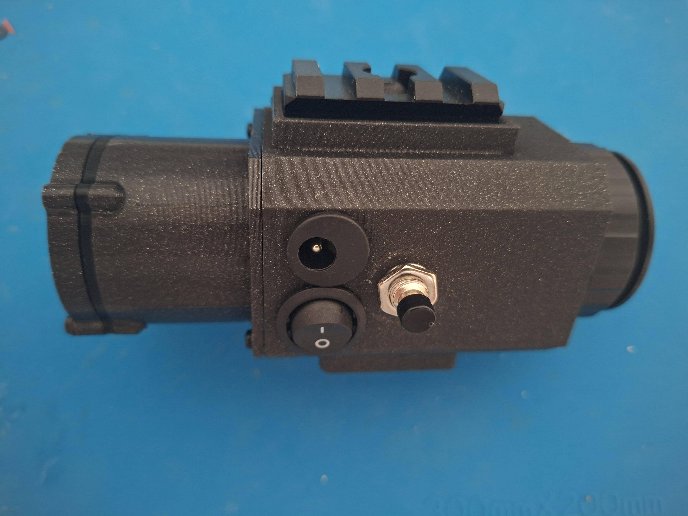

# DIY Thermal Monocular — ESP32 + 256×192 Thermal Camera

> Build your own handheld thermal monocular for ~€400. Open-source firmware, 3D-printed body, RIS/Picatinny rail compatible.



---

## What is this?

A fully functional **DIY thermal imaging monocular** built around a 256×192 thermal camera, an ESP32-C3 microcontroller, and a 0.39" OLED display — all packed into a 3D-printed body with an 18× eyepiece. It mounts on any standard Picatinny/RIS rail and costs a fraction of commercial thermal optics.

**Commercial thermal monoculars run €1,000–€5,000+. This build costs ~€400.**

---

## Features

- **256×192 thermal sensor** — 9mm lens, CVBS output
- **ESP32-C3** microcontroller with open-source firmware (ESP-IDF v5.5.3)
- **0.39" OLED display** with AV input — crisp image in the eyepiece
- **RIS/Picatinny rail mount** — fits standard rifle/observation setups
- **J-arm mount** option for head/helmet mounting
- **Wilcox mount** option for head/helmet mounting
- **Adjustable image orientation** — flip vertical/horizontal in firmware
- **Physical controls** — potentiometer + push buttons for on-device menu navigation
- **5.5×2.1mm DC power inlet** — run from external battery pack
- **3D-printed body** — printable on any FDM printer, all STLs included
- **Flashable via browser** — no toolchain needed for end users

---

## Specs

| Property | Value |
|---|---|
| Thermal sensor | 256×192, 9mm lens, CVBS |
| MCU | ESP32-C3 Super Mini |
| Display | 0.39" OLED (AV input) |
| Power | 5V via 5.5×2.1mm DC jack |
| Rail mount | Picatinny / RIS compatible |
| Firmware | ESP-IDF v5.5.3, open source |
| Total BOM cost | ~€400 |

---

## Repository Structure

```
├── docs/
│   ├── build-steps.md     # Full assembly guide
│   └── BOM.md             # Bill of materials with links
├── resources/
│   ├── wiring/            # KiCad schematic + PCB files
│   ├── build_photos/      # Build process photos
│   └── 3d_print/          # STL files for the body
├── compiled_binaries/     # Pre-built firmware — flash without a toolchain
└── source_code/           # ESP-IDF firmware source
```

---

## Quick Start

### Flash the pre-built firmware (no toolchain needed)

See [compiled_binaries/README.md](compiled_binaries/README.md) — flash directly from your browser or with `esptool.py`.

### Build & assemble

1. Order parts from the [Bill of Materials](docs/BOM.md)
2. Print the body STLs from `resources/3d_print/`
3. Follow the [Assembly Guide](docs/build-steps.md)

### Build firmware from source

```powershell
# In ESP-IDF CMD (Windows — use the Start Menu shortcut, not plain PowerShell)
cd source_code
idf.py set-target esp32c3
idf.py build
idf.py -p COM1 flash
```

---

## Wiring

Schematic and PCB files are in `resources/wiring/` (KiCad format). A PDF export is also included.

---

## Author

**Richard Husár** — [@xhusar2](https://github.com/xhusar2) — husarrichard@gmail.com

Licensed under the terms in [LICENSE](LICENSE).

---

*Keywords: DIY thermal monocular, ESP32 thermal camera, open source thermal imaging, 3D printed thermal monocular, budget thermal optics, night vision DIY, OLED thermal viewer, ESP32-C3 thermal, Picatinny thermal scope*
